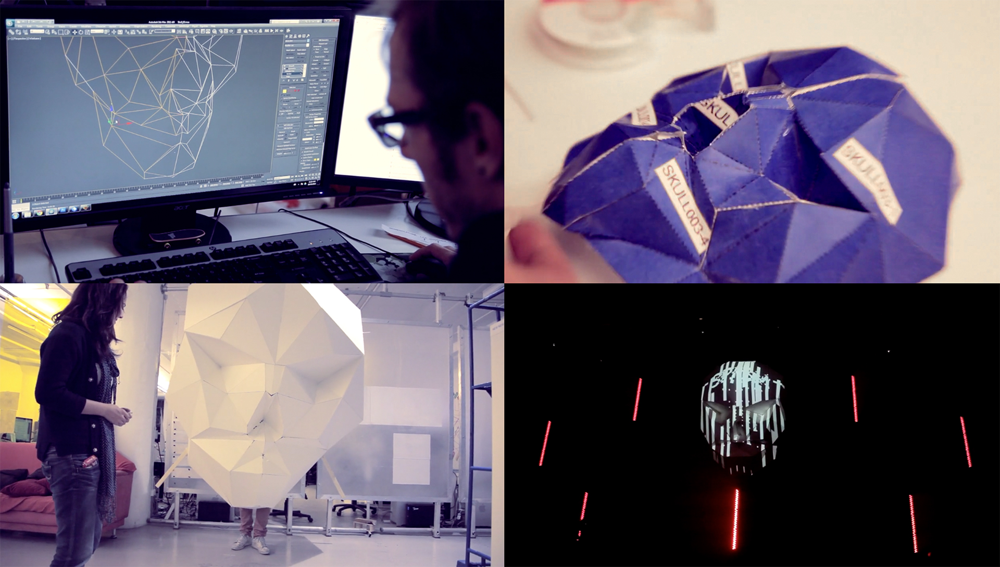
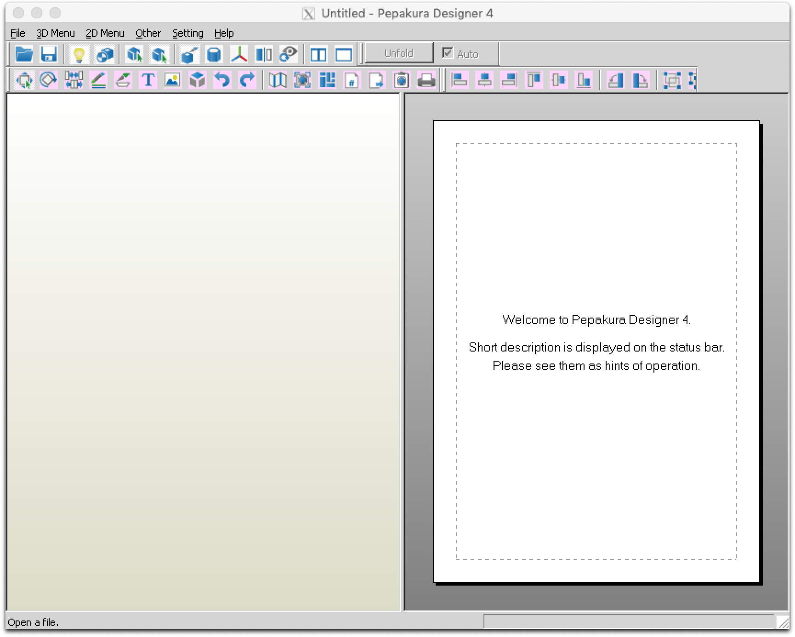
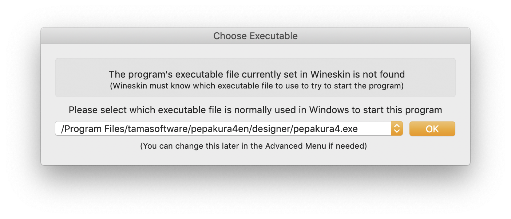
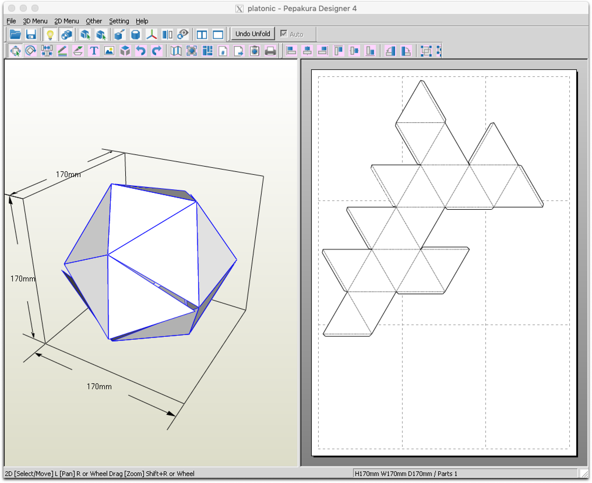

# Pepakura

Ever heard of paper craft?  It's the art of creating one, [two](https://www.google.com/search?q=paper+craft+2d) or [three-dimensional](https://www.google.com/search?q=paper+craft+3d) objects in paper. To create custom and complex designs, Pepakura offers the transformation from digital object to real world folding instructions. Upscale  the measurements to create large scale sculptures, and [light them up using projection mapping](https://vimeo.com/328475901) for radical paper brightness!

_For large projects make sure to use Foam Board \(Kapaskiva\), at either_ [_3mm_](https://www.svexo.se/kapaskiva-3mm-70x100cm-25fp) _or_ [_5mm_](https://www.svexo.se/kapaskiva-5mm-100x140cm-25fp) _\(preferred\) thickness.  Use fishing wire to cross-stitch several boards together. Cut the boards with a sharp mat cutter or X-Acto knife._

### Install

Get [Pepakura](https://tamasoft.co.jp/pepakura-en/download/index.html) and if you are a non Windows user, install [Wineskin](https://sourceforge.net/projects/wineskin/) as it enables Windows applications to run on Mac_._ 


Does not work on Catalina!


Use any of the several guides \([this](https://www.youtube.com/watch?v=cHpqP0FET0w) and [this](https://www.maketecheasier.com/pepakura-designer-mac/)\) out there, or follow along:

1. Open Wineskin, click the **plus** symbol and add the latest version. Return to the main window.
2. Click **Update** and get the latest wrapper version.
3. Once ready, click **Create New Blank Wrapper** and name it "Pepakura Designer".
4. Give it some time… click **View wrapper in Finder** and open the wrapper app.
5. Click **Install Software** and select the  Pepakura executable _setup\_pepakura416\_en.exe from before._
6. Follow the instructions and agree to everything. Ignore the error saying "Error: Invalid operation". 
7. The software should now open!

Close Pepakura and open it again. It will now request which executable it should use. Make sure to select _pepakura4.exe_ from the list.

Click **OK** and exit Wineskin by simply closing the window. Next time it is opened it should open the app directly.

_If you don't like the default app icon, download the official  icon below, then right-click the app and drag the icon to the thumbnail._



### Using Pepakura

Pepakura works with several formats but OBJ is recommended. This format can be easily exported from popular 3d tools. Click **File** and **Open** and choose your OBJ file \(use the example file below to test\).



Once opened, click **Unfold** and follow the instructions. Then, simply export the output.

For information on how to understand the instructions, view the guide [What is Pepakura and how to start](https://www.instructables.com/id/What-is-Pepakura-and-how-to-start/). Go ahead and create some spectacular designs or use [existing ones](https://www.exploring.technology/l/s/a-frame/basics/models)!

