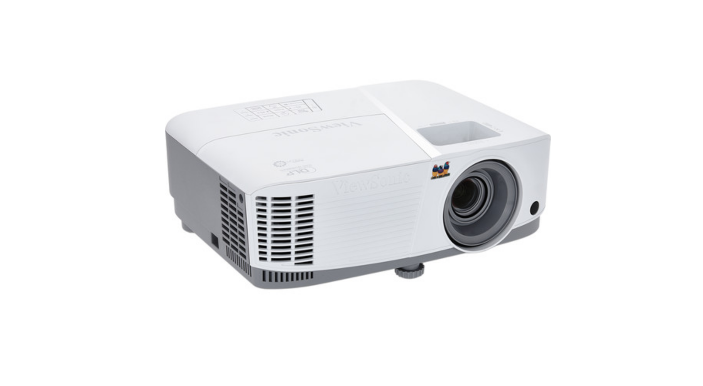
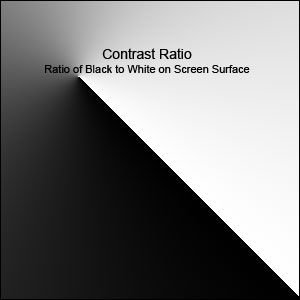
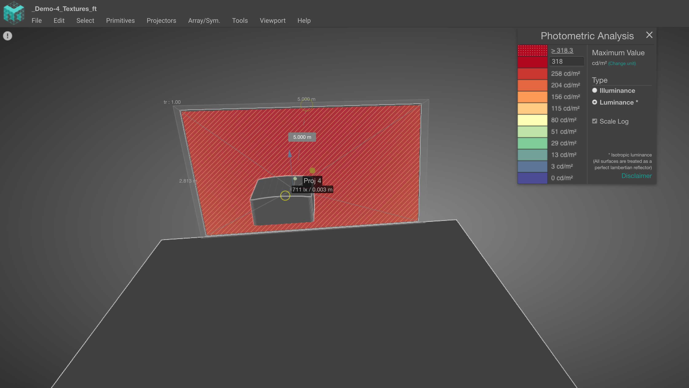

# Projectors

## **Guide to projectors**

Video projectors are for sure one of the most important tools for creators of interactive installations and artists. 

In this guide I will focus on the  projector as hardware, technical concepts and terminology.

## What is a Projector ?

Projectors are an amazing piece of equipment, that can help us to create amazing art and interactive installations, also using a projector and projection we can play with the perception of reality using light and shadows, but technically a projector is just a complex flashlight that shoots a square shaped image  ****:\)

## Planning

As a good practice you should always plan ahead and make a checklist before choose a projector for interactive installation or larger projection. Here is a sample of a checklist.

* What are you projecting on? 
* Size of the projection?
* Scrim material?
* Flat surface or complex geometry?
* Architectural projection?
* What is the environment like?
* indoor or outdoor?
* Color of the surface?
* Front or rear projection? 
* Portrait mode projection?
* Floor projection?
* Permanent projection? How many hours the projector will be ON?
* Network control?
* How much ambient light is there? Is it a bright show room, or a dim purpose-lit space? Is there lighting design?
* How to mount the projector?
* How will you run the cables from the projector to the computer? How many meters of cables will you need?
* Where is the projection Sweet Spot?
* Is there a potential people casting shadows?

![Hakana&#xEF; \[Adrien M &amp; Claire B\]](../.gitbook/assets/amcb-hakanai-c-romainetienne5123-w1800-h1800-1170x780.jpg)


**Visiting the installation venue/space is optimal when starting to plan your installation. This will get you the best sense of space, positioning options and sense of ambient light.  Another important thing is to ask for the CAD drawings of the space.  So now it is up to you if you want to make a 3D render of the placement or even making a scale mode.** 

**This tool is amazing and will save you a lot of time** [https://www.mappingmatter.com/](https://www.mappingmatter.com/)


![3D render layout from Hakana&#xEF; \[Adrien M &amp; Claire B\]](../.gitbook/assets/adrienm-and-claireb_hakanai-_projectorsetup.png)

##  Projector Technology

I will go briefly through the different type of technologies.

Most of the times we will choose the projector that is available to us and within the budget, and probably we don’t pay so much attention to type of technology the projector has, but in my experience knowing your projector can make a huge difference in your project.

* DLP
* LCD
* LASER ⚡️

## DLP

DLP stands for “_Digital Light Processing_.”This is one of the most commonly used projector types. One of the key features of a  DLP technology is that it can display much darker blacks than LCD technology which is especially helpful for illusions like projection mapping. 

Within DLP projectors you can find two types, Single chip and 3-Chip. In single chip DLP,  a light source is passed through a rapidly spinning multi-segment color wheel of 3 or more dichroic glass sections \(7 or more color segments is a more "desirable" spec than 3\). That light then bounces off a matrix of electrically controlled microscopic mirrors that determine the brightness of each individual pixel. The beam then passes through filters and out through a lens. The timing between the color wheel and the movement of the mirrors determines the color of the output.

Standard DLP projectors use 3-segment color wheels. 4-part color wheels add a white segment \(to increase brightness\). 6-segment color wheels deliver a wider color range. [6x Speed RGBRGB Color Wheel projectors](https://www.viewsonic.com/us/px725hd.html) boost red, blue, and green hue and saturation. The result: vivid images with smoother color gradients. 

Here is more information about it: [https://forums.afterdawn.com/threads/the-3-types-of-projector-explained-lcd-dlp-crt.291323/](https://forums.afterdawn.com/threads/the-3-types-of-projector-explained-lcd-dlp-crt.291323/)

## LCD

There are a couple different LCD technologies for projection, but 3LCD is probably the most recommended in terms of image quality. With LCD projection, a light source is bounced through 3 dichroic filters that turn the white light into precise red/green/blue frequencies. Those differently colored beams of light then pass through liquid crystal arrays that turn on and off their pixels and block the different light patterns to form the image. Those LCD's are then recombined with a prism that recombines the 3 colored segments into a single light beam/image that then passes through a lens. 

LCD projection doesn't have the rainbow banding effect that DLP does and tends to be easier to film, but it doesn't have the darkest blacks, so it doesn't disappear as much when the screen is just displaying a black image, and you can see more like a grayish color.

## Laser

What can I say about Laser projectors, well they are the " new thing" and they are super cool, and set to become the standard for projector technology.  According to Futuresource, the market for projectors in 2020 will be 74% laser based. It offers reliability, high brightness, and is set to offer significant advantages to a range of industries or applications including cinema, large venues, education and control room. 

#### Laser offer  new benefits and here is a few of them:

* Illumination source lifetimes of 20,000 hours or even more
* More brightness – up to 70,000 lumen
* Lower brightness decline during life time
* Better brightness uniformity
* Generally maintenance free, as no lamp replacement necessary
* Higher reliability
* Higher contrast
* Wider color gamut
* Lower energy consumption and lower thermal emission
* Instant on/off capability, flexible brightness adjustment \(20-100%\)
* Mercury free

There are numerous benefits with a laser light source, but the bottom line is that they more closely address the needs of the market and laser is being adopted in growing numbers. 

The qualitative brightness superiority and potential for energy savings combined with the significant reduction of maintenance cost makes it likely that laser will eventually replace lamp-based projection systems as the primary projection light source.


**There is a myth out there about Laser projectors can only be installed by specialists. This might have been true previously, as laser regulation meant that the installation process had to be conducted by a trained professional. Now, however, the installation of laser projectors has been made easier, as classification changes mean that specially trained laser officers are not required – previously this would have added complexity to the installation. Now, there are recommendations for health and safety but is it no longer in the realm of laser regulation. For early adopters of laser, this transforms the installation process, making it easier, more cost-effective and faster.**


## Projector Type

Each project might need a different type of projector, maybe you are doing a projection in dark and control room in an art gallery or an interactive projection and you can’t have the shadows of the audience, or could be a massive projection and you need 20 large venue projectors. 

When you are planning your project is very important to understand what type of projector you need and why.

#### Pico Projectors

I’m not going to talk so much about this one, because probably you will not find so many situation where you need this type of projector.  Normally the **Brightness range :** 20 lumens to 1000 lumens, and a **Resolution range :** 640 x 360 to 1280 x 800

Some pico projectors can be powered with batteries, and just few has infinite depth of field and require no focusing, so you can project on very close up things clearly.

But if you want to get inspired with what you can do with a pico projector and be creative here is a nice example: [https://www.youtube.com/watch?v=cwL3PEeE0sU](https://www.youtube.com/watch?v=cwL3PEeE0sU)

#### \*\*\*\*

#### **Portable Projector**

This type probably you are very familiar with, they are very common in classrooms and small office space. Normally they only have a single lamp, not so bright and the mechanical parts inside are not so stable, so don’t crazy with this type of projector.

**Brightness range:** 1000 lumens to 3000 lumens **Resolution :** 1024x768 to 1080 p

For sure you can use these ones in an installation, but be aware they aren't designed for that, most of the times can be very difficult to setting them up in an installation. Some projectors just don't handle 24/7 operation very well, so keep this in mind. 

With portable projectors you will encounter multiple limitations: 

* Limited options for throw ratio 
* Image sizes
*  Brightness range
* Very limited zoom adjustments
* No lens shift

If you want to use this type in an outdoor installation just take in consideration that it has to be pitch black and not so big screen size.

#### Installation Projectors

So probably over 85% of your projects will be **OK** using this type of projector, and media artists loves these ones.

**Price Range:** $2200 - $13,000 **Brightness range**: 3000-10000 lumens **Resolution range**: 1280x720 to 1920 x1200

It's hard to cover  as there are a wide range of brands, lenses, and imaging elements. 

They will cover you in most indoor installations if you're trying to cover a reasonable amount of space \(ambient light and windows permitting\). These ones tend to be heavier and larger \(6 kg+\) but offer more configuration options than the portable class \(control over LAN and HDBaseT\). They are also designed for 24/7 operation so they are more acceptable to use for long term installations. Some models also support portrait mode projection and 360º rotation. Maintenance and support is generally easier with these as well, but at an obvious jump in price.

These projectors also start to bring in multiple lens options for short throw 0.4 to long throw 4.0 ratio with the same body. They also offer more options for lens zoom and lens shift which are super handy.

If you're trying to get more than a 6 meters wide image or are dealing with stage lighting,  you will need to do some brightness and size calculation before you commit to these ones, but we will talk about that later. 

If you are planning to have an installation longer than a week probably will make more sense if you buy one one of these instead of renting, it quickly becomes more cost effective to just purchase one of these classes of projectors \(or the portables\) because you would be paying the same amount in a week or so anyway.

#### Large venue projectors

Most of the time if you ever need a large venue projector probably you are hiring a company that does all the calculations for you,  nevertheless still a good a idea to have a solid understanding on how to work with this type of projectors. 

**Price Range**: $8000 - More than a house       **Brightness Range**: 5000 lumens to 75,000 lumens \( as far as I know\)  **Resolution Range**: 1920x1080 to 4K

These ones are commonly used for large scale projection mapping, big venue concerts or the theater. 

The high powered bulbs in these ones are also much more of a safety issue. When choosing a 15k versus a 30k rental for an event, I highly trained technical staff often has to be on-site to handle the operation of the projector, some venues and countries need the fire marshall to approve the use of it because of the potential of a fire hazard . The power of the bulbs also significantly shortens their lifespan down to about 1000 hours of operation compared to the smaller ones. The aging of these bulbs also has a much more noticeable effect on the image. Older bulbs will look much dimmer and more off color than brand new bulbs - something to keep in mind if you're working with multiple high power projectors is to keep an eye on bulb life.

Placement and mounting of these projectors is another important consideration. Some of the larger ones weigh 100+ kg and will require trussing and investigation about whether the ceiling or structure can actually support them. For some events you may end up constructing a scaffold tower with the huge projector on top, and with your power supplies, media servers and workspaces underneath.

Like installation projectors, large venue projectors often offer multiple lens options for the same projector. Most offer throw ratios from 0.8 to about 7.0 or 12.0. These super zoomed ratios are helpful if you have a really tall building to projection map from the ground, or a screen that is over 30 meters away and you're trying to conserve your precious photons. 

## How to read the spec sheet

Projectors can be very similar to each other and for sure their function is almost the same, but it is important to know that each projector is different and each project might need an specific type. So being able to read and understand a projector spec sheet is an important  skill to have when planning your project. You'll have to separate the parts that are important, from the values that aren't standardized .

#### 

#### Resolution : 

This is a term that we are fully aware today,  we see it from our computer screens, phones and tv and projectors are not any different.

This is the actual maximum resolution the projector is capable of displaying. You can send it higher resolutions than this, but the physical number of pixels will remain the same. If it's native resolution is 1280x720 and you send it 1920x1080p, there is just going to be down sampling to match native resolution. If you see the spec "Supported Resolutions" - Warning! This spec is nearly useless and incredibly misleading. Only pay attention to the native resolution if you want the physical pixel count. Supported resolutions just means the resolutions that the projector is capable of accepting and then down sampling or up sampling to match its native resolution. 

it is very common now to see projectors that "support" 4K resolution but this is only a marketing strategy, because the real native resolution is 1920 x1080p . But what they are doing is using pixel shift. 

"**Shifting** the red and blue sensors half a **pixel** in both the vertical and horizontal direction permits the recovery of a 1920 × 1080 luminance signal. This technique is seeing a renaissance with native 1080p video **projectors** that **pixel shift** horizontally to produce an effectively 4K image on the screen."

So to make it simpler to understand those 4K pixels are not coming out the lens we are only getting a 1920x108p.

**Lumens:** This spec is somewhat standardized with ANSI units, but different manufacturers can waver a bit. A difference of a couple hundred lumens between projectors isn't much to consider if you need something slightly brighter, it's easier to think in 1000 lumen increments generally. Also, as a guidance, you'll want at minimum around 215 lumens per square meter of image.  Below I will explain how you calculate the brightness.

Lumens generally is one of the most important features in a projector and with higher lumens you can over come ambience lighting.

**Contrast Ratio:** This non-standardized misleading unit used by the manufactures.

Contrast ratio in its simplest form is the ratio of the light reflected from an all white image and an all black image. So a projector with a 3000:1 contrast ratio means that the white image is 3000 times brighter than the black image. The higher the contrast ratio, the more detail you can see on the projected image whether it is numbers, pictures, graphs, text, or video. Contrast is what makes it possible for us to see the subtle shades of colors. 

So good contrast is all about seeing the details 3000 :1 contrast ratio is poorer than 10,000:1  but companies use different ways to quantify their contrast, so it can be very hard to gauge what the reality is until you get one. Some projectors also have dynamic contrast which means that they automatically adjust their lens to provide darker blacks depending on the image that is coming through

As you can see in the picture above a good contrast ratio is an important feature to achieve deeper blacks and bright whites.

**Throw ratio:** This is probably the second most important specification behind lumens. This value gives you the ratio of the width of the projected image to the distance from the surface. If we know the throw ratio we can calculate where to place the projectors .For example, a throw ratio of 1:1 means that for every 1meter away from the wall, you will get 1meter of image width \(and your height is determined by the aspect ratio\).Lens zoom is also a related property because it allows you a small "variable" lens shift.

**Lens Shift:** Lens shift is generally only available on higher end projectors. Most projectors have a slight lens offset that allows them to be below or above their screen and still have a square image.  Lens shift allows you to correct for this offset if necessary . Do not confuse lens shift with just tilting the projector, if you tilt the projector  would result in more key-stoning. Some projectors have manual or motorized lens shift and this depends on the price range of the projector. 

Having the freedom of controlling the lens shift will let you to worry less about exact placement of your projector because you will be able to shift the light beam around.

Most of the time I like to do the throw ratio calculation myself, but if you are not like me you could find plenty of website or apps that does that.  [Projector calculator](https://www.projectorcentral.com/projection-calculator-pro.cfm) and [iOS app](https://apps.apple.com/us/app/projectorpro/id542534287) , also most of the projector manufactures has their own online projector calculator.

Manufactures numbers can be a little bit off,  or you may need to shift the placement few centimeters. So it is always good to  have an extra +/- 5% of image could be really helpful.

### Brightness 

Our primary concern is our lumens per square meter ratio, as this is the value that really changes the final output. This is just calculated as: **Total Lumens / Area of projection** 

$$
3000 Lumens / 6m² = 500 lumes/m²
$$

You want to stay above a minimum value of around 215lumens/m².  If you go  below that value, you run the risk of your brightness and contrast being so weak that your image is washed out or unacceptably dim in less than ideal conditions.

There are many factors that can alter the eye's perception this calculated value including:

* Screen type /Screen gain - reflectivity of the screen
* Surface type / Material
* Ambient light 

Your type of surface can also affect your total brightness and contrast. Walls, screens, building exteriors, scrims, front or rear are all decisions that carry their own potential issues. Avoid really dark surfaces at all costs, as they absorb much of your photons and don't reflect as many. However, in some situations gray screens are preferable over white screens because the gray can absorb more of the ambient light and improve contrast.


If you want to read more about brightness, materials and screen gain here is and important reading.

[http://www.projectorcentral.com/home\_theater\_projector\_buyers\_guide.htm?page=Brightness](http://www.projectorcentral.com/home_theater_projector_buyers_guide.htm?page=Brightness)

[http://www.projectorcentral.com/white\_gray\_projection\_screens.htm](http://www.projectorcentral.com/white_gray_projection_screens.htm)

[http://www.projectorcentral.com/projector\_screens\_gain.htm](http://www.projectorcentral.com/projector_screens_gain.htm)


