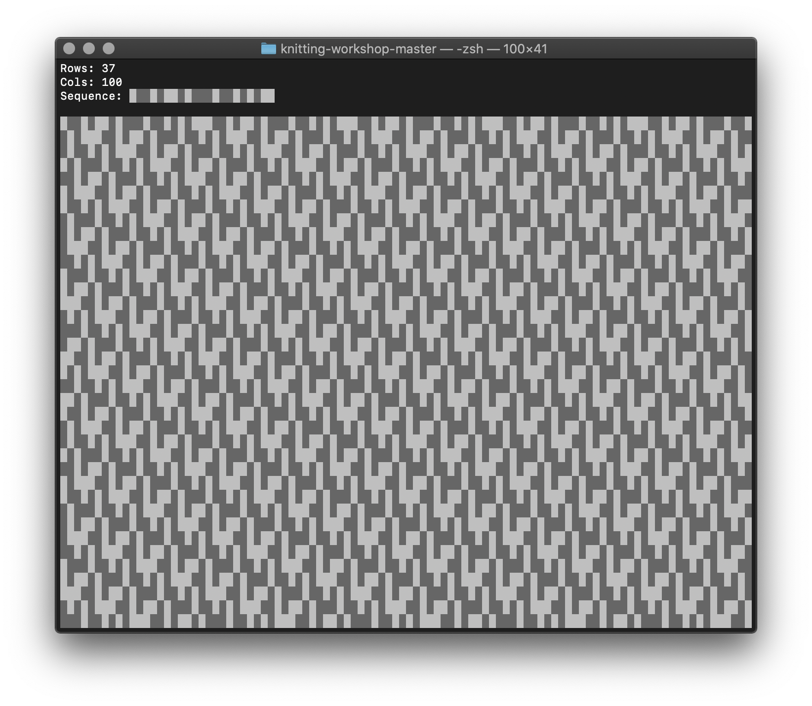

# Enhanced radical knitting using JavaScript and the Terminal


Written by [Alexander Wallin](https://www.alexanderwallin.com/)


Ever wondered how you can use JavaScript and the Terminal to create experimental knitting patterns, and guide us through the actual knitting?

This is a beginner-to-intermediate introduction to programming and  knitting, but the idea is that you don't have to know either to get the gist. The main point is to introduce these topics and try to show ways of combining technology and craft in a way that will inspire you to experiment with whatever you enjoy creating.

In order to follow along you need the following:

1. Basic programming knowledge and some experience using the Terminal \(you know how to open it and run a command\).
2. A text editor like [Sublime Text](https://www.sublimetext.com/) or [Visual Studio Code](https://code.visualstudio.com/).
3. [Node.js](https://nodejs.org/en/) and `npm`, a package manager for Javascript
4. [Homebrew](https://brew.sh/), a package manager or MacOS.
5. [JP2A](https://csl.name/jp2a/), a command line image-to-ASCII converter installed via ports or brew.
6. The `npm` packages `chalk`, `date-fns`, `got`, `lodash` and `nodemon`.


There are two[ repository](https://github.com/alexanderwallin/knitting), the full project and the [workshop](https://github.com/alexanderwallin/knitting-workshop).


## Getting started

### Terminal

The terminal \([guide](https://blog.teamtreehouse.com/introduction-to-the-mac-os-x-command-line)\) is an interface where you run commands on a command line. We will use it to download things from the Internet, write things to We'll be using the MacOS Terminal, but much of this is also applicable to Windows and Linux environments.

### JavaScript

JavaScript \([introduction](https://javascript.info/intro)\) is a programming language that makes web pages interactive. It can also be run outside browsers, for instance in the terminal using Node.

Building JavaScript programs is easier when you don't have to do everything yourself, so we'll install and use publicly available packages from [npm](https://www.npmjs.com/).

### Knitting

Knitting \([introduction](https://youtu.be/p_R1UDsNOMk)\) is the ancient magic of looping strands of yarn into clothes or other things. While it can get as complex as you like, getting started and making your first scarf is fairly easy and straightforward.

### The Workshop

#### **Get familiar with the terminal**

We'll look at downloading things from the Internet, writing files, piping, running JavaScript programs and a few more bits and bobs.

#### Generate knitting patterns using JavaScript

Define parameters to experiment with \(basic [generative design](https://en.wikipedia.org/wiki/Generative_design)\).

#### **Use external data sources to produce designs.** 

We'll test things out with imagery and some nature and weather data.

#### C**reate simple interfaces that help us knit!**

Since knitting is complex, random and/or non-repetitive patterns is hard to do from simply looking at them.

